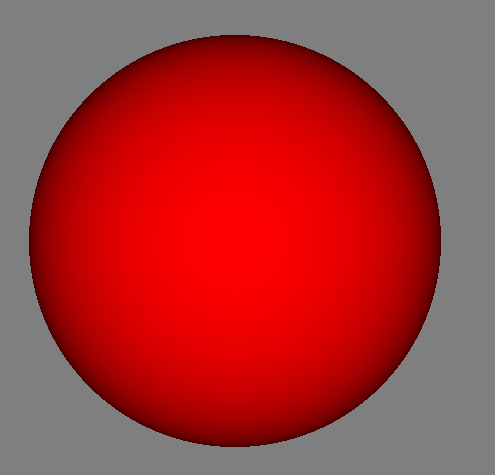

# Sphere Tracing on GPU
Example implementation of sphere tracing on a GPU.

The application renders a full screen quad using an empty vertex array and performs sphere tracing in the fragment shader.

## References:
Hart, J. Sphere tracing: a geometric method for the antialiased ray tracing of implicit surfaces. The Visual Computer 12, 527–545 (1996). https://doi.org/10.1007/s003710050084